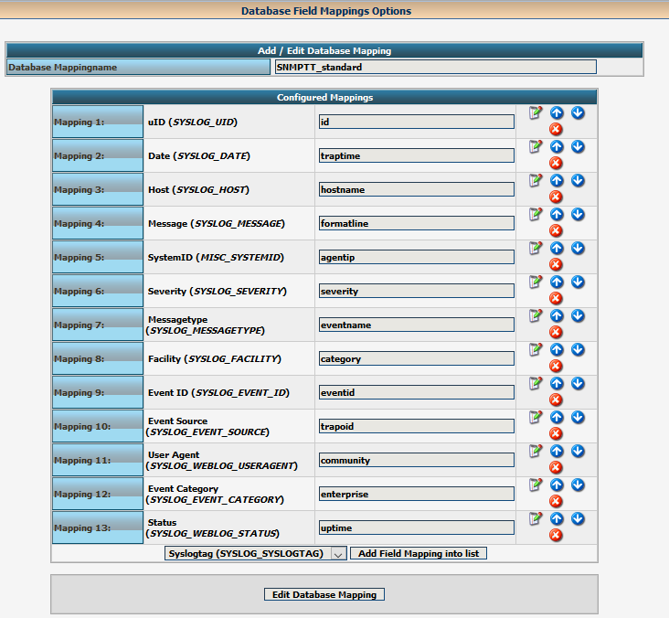
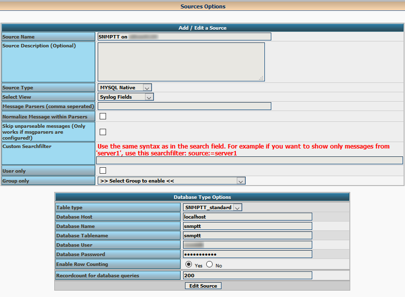

## SNMP trap collector with mysql database
 
## SNMP Trap receiver (former EventDB) on RedHat

#### Install snmp package:
```
yum install net-snmp net-snmp-utils 
```

now we have to decide if Variant 1 or 2 (2 is preferred because of translated traps)

## VARIANT 1: 
#### Creating just a normal trap database

Now, we need to create the database the traps will be stored in, as well as the database user we will use when logging traps.
```
mysql -u root -p
```

#### Create the database we will log traps to:

```
MariaDB [(none)]> create database net_snmp;

MariaDB [(none)]> create user 'netsnmp'@'localhost' identified by 'sekritpass';
MariaDB [(none)]> grant all on net_snmp.* to 'netsnmp'@'localhost' identified by 'sekritpass';
```
 
#### Create the schema we will enter data into. 
A database schema is the actual structure we write data to, including the tables. 
Consider it the 'shape' and 'function' of the database. 
The file describing the database schema is, as far as I can tell, not installed with snmpd. 
But it is present in the net-snmp source code distribution. 

I reproduced it below. 

#### Copy and paste this at the MariaDB prompt:
```
USE net_snmp;
DROP TABLE IF EXISTS notifications;
CREATE TABLE IF NOT EXISTS `notifications` (
  `trap_id` int(11) unsigned NOT NULL AUTO_INCREMENT,
  `date_time` datetime NOT NULL,
  `host` varchar(255) NOT NULL,
  `auth` varchar(255) NOT NULL,
  `type` ENUM('get','getnext','response','set','trap','getbulk','inform','trap2','report') NOT NULL,
  `version` ENUM('v1','v2c', 'unsupported(v2u)','v3') NOT NULL,
  `request_id` int(11) unsigned NOT NULL,
  `snmpTrapOID` varchar(1024) NOT NULL,
  `transport` varchar(255) NOT NULL,
  `security_model` ENUM('snmpV1','snmpV2c','USM') NOT NULL,
  `v3msgid` int(11) unsigned,
  `v3security_level` ENUM('noAuthNoPriv','authNoPriv','authPriv'),
  `v3context_name` varchar(32),
  `v3context_engine` varchar(64),
  `v3security_name` varchar(32),
  `v3security_engine` varchar(64),
  PRIMARY KEY  (`trap_id`)
) ENGINE=InnoDB DEFAULT CHARSET=latin1;

DROP TABLE IF EXISTS varbinds;
CREATE TABLE IF NOT EXISTS `varbinds` (
  `trap_id` int(11) unsigned NOT NULL default '0',
  `oid` varchar(1024) NOT NULL,
  `type` ENUM('boolean','integer','bit','octet','null','oid','ipaddress','counter','unsigned','timeticks','opaque','unused1','counter64','unused2') NOT NULL,
  `value` blob NOT NULL,
  KEY `trap_id` (`trap_id`)
) ENGINE=InnoDB DEFAULT CHARSET=latin1;
```

#### Konfigurationen:

> /etc/snmp/snmp.conf
```
mibdirs  +/etc/snmp/translatedMIBS
# mibwarninglevel: Should warnings about mibs be displayed when the mibs are loaded
#   arguments: 1|2
mibwarninglevel  1
```

> /etc/snmp/snmptrapd.conf 
```
# Example configuration file for snmptrapd
#
# No traps are handled by default, you must edit this file!
#
# authCommunity   log,execute,net public
# traphandle SNMPv2-MIB::coldStart    /usr/bin/bin/my_great_script cold

#authCommunity log YOURCOMMUNITYSTRING
disableAuthorization yes
sqlMaxQueue 1
sqlSaveInterval 9
```

> /etc/my.cnf.d/snmptrapd.cnf
```
[snmptrapd]
user=USER
password=PASSSWORD
host=localhost
```

#### So you can send traps to the database using:
```
snmptrap -v 2c -c public IPofTRAPRECEIVER "TEXT" 1.2.3.4.0
```

## VARIANT 2: (PREFERED)

### Database with trap translator: (PREFERED)

#### Install necessary packages:
```
yum install perl-NetAddr-IP perl-DBI perl-DBD-MySQL perl-Text-ParseWords perl-Getopt-Long perl-Time-HiRes perl-Sys-Syslog perl-Socket perl-AppConfig perl-Config-Tiny perl-Config-Simple perl-Scalar-List-Utils perl-Test-Simple perl-IO-stringy perl-List-MoreUtils net-snmp-perl perl-SNMP_Session
```

```
optional:
perl-DBD-Pg
perl-Net-SNMP
perl-threads
perl-Digest-MD5
```

#### Download snmptt package from https://sourceforge.net/projects/snmptt/
(no install package in redhat repository)


Unpacking:
```
> tar xvfz snmptt_1.4.tgz
>useradd -g icinga -s /bin/false snmptt
>install -o root -g root snmptt /usr/sbin
>install -o root -g root snmptthandler /usr/sbin
>install -o root -g root snmpttconvertmib /usr/sbin
>install -o root -g root snmptt-init.d /etc/rc.d/init.d/snmptt
```

#### Add the service using chkconfig:
```
chkconfig --add snmptt
```

#### Configure the service to start at runlevel 2345:
```
chkconfig --level 2345 snmptt on
Snmptt will be started at the next reboot, or can be started immediately with:
service snmptt start
or
/etc/rc.d/init.d/snmptt start
```

To manually start snmptt, use:
```
snmptt --daemon
install -o root -g root snmptt.ini /etc/snmp/
install -d -o snmptt -g icinga -m 4775 /var/spool/snmptt
install -d -o snmptt -g root -m 755 /var/log/snmptt
```

#### configure the snmptt.ini (see part Konfigurationen below)

We use a additional script /etc/sysconfig/snmptrapd to configure the start process of the snmptrap daemon.

~~SNMPTRAPD_PID=/var/run/snmptrapd.pid~~
~~SNMPTRAPD_OPTS="-On"~~
~~SNMPTRAPD_CONFIG="/etc/snmp/snmptrapd.conf"~~
~~umask 002~~
OPTIONS="-On -Lsd"
umask 002


Important: We have to set the umask. The traps are stored from the snmptrapd as owner root and with gid icinga to the spool directory /var/spool/snmptt. The snmptt will run as user snmptt and the process have to be able to delete the traps are spooled.

Before we could start snmptrapd, we have to write the real configfile of snmptrapd to */etc/snmp/snmptrapd.conf. (later described again!)
```
disableAuthorization yes
traphandle default /usr/sbin/snmptthandler
```

#### Configuring the Database

~~> mysql -u root -p~~

~~create database eventdb;~~

~~grant all privileges on eventdb.* to 'eventdb'@'localhost' identified by 'YOURPASSWORD';~~

~~grant select on eventdb.* to 'eventdb_r'@'localhost' identified by 'YOURPASSWORD_r';~~


~~##### For database scheme we use the scheme from eventdb~~ 


~~tar xvfz eventdb-2.0.6.tar.gz~~ 

~~mysql eventdb -pYOURPASSWORD eventdb < /PATHTODOWNLOAD/eventdb/db/mysql/createTables.sql~~


#### To configure SNMPTT for MySQL, modify the following variables in the snmptt.ini file.
```
    mysql_dbi_enable
    mysql_dbi_host
    mysql_dbi_port
    mysql_dbi_database
    mysql_dbi_table
    mysql_dbi_table_unknown
    mysql_dbi_username
    mysql_dbi_password
```

Note:  Sample values are defined in the default ini file.  Defining mysql_dbi_table_unknown is optional.

#### The following MySQL script can create the database and table. Permissions etc should also be defined. Run 'mysql' as root and enter:
```
 CREATE DATABASE snmptt;
    grant all privileges on snmptt.* to 'YOURUSER'@'localhost' identified by 'YOURPASSWORD';
```

```
USE snmptt;
    DROP TABLE snmptt;
    CREATE TABLE snmptt (
    id INT UNSIGNED NOT NULL AUTO_INCREMENT PRIMARY KEY,
    eventname VARCHAR(50),
    eventid VARCHAR(50),
    trapoid VARCHAR(100),
    enterprise VARCHAR(100),
    community VARCHAR(20),
    hostname VARCHAR(100),
    agentip  VARCHAR(16),
    category VARCHAR(20),
    severity VARCHAR(20),
    uptime  VARCHAR(20),
    traptime VARCHAR(30),
    formatline VARCHAR(255));
```

Note: To store the traptime as a real date/time (DATETIME data type), change 'traptime VARCHAR(30),' to 'traptime DATETIME,' and set date_time_format_sql in snmptt.ini to %Y-%m-%d %H:%M:%S.

Note: If you do not want the auto-incrementing id column, remove the 'id INT...' line.

Note: To store the traptime as a real date/time (DATETIME data type), change 'traptime VARCHAR(30),' to 'traptime DATETIME,' and set date_time_format_sql in snmptt.ini to %Y-%m-%d %H:%M:%S.

#### If logging of statistics to a SQL table is required, create the snmptt_statistics table using:
```
USE snmptt;
    DROP TABLE snmptt_statistics;
    CREATE TABLE snmptt_statistics (
    stat_time VARCHAR(30),
    total_received BIGINT,
    total_translated BIGINT,
    total_ignored BIGINT,
    total_unknown BIGINT);
```


#### Now it's time to convert some MIBS for the snmptt:
```
cd /usr/share/snmp/mibs/
snmpttconvertmib --in=NET-SNMP-AGENT-MIB.txt --out=/etc/snmp/translatedMIBS/snmptt.conf
snmpttconvertmib --in=SNMPv2-MIB.txt --out=/etc/snmp/translatedMIBS/snmptt.conf
```

#### configure the snmptrapd.conf (see part Konfigurationen below)
```
start snmptt
service snmptt start
Starting snmptt (via systemctl):  Job for snmptt.service failed because the control process exited with error code. See "systemctl status snmptt.service" and "journalctl -xe" for details.
[FAILED]
```

#### If this error occurs install/update Scalar::List > 1.33

``` 
tar xvf Scalar-List-Utils-1.47.tar.gz
cd Scalar-List-Utils-1.47
perl Makefile.PL 
make
make test
make install
```

#### Install Config::IniFiles

```
tar xvf Config-IniFiles-2.94.tar.gz 
cd Config-IniFiles-2.94
perl Build.PL
Build
Build test
Build install
```

#### Start service again 
```
service snmptt start
```

#### change startscript for snmptrapd:
```
original file:
[Unit]
Description=Simple Network Management Protocol (SNMP) Trap Daemon.
After=syslog.target network.target

[Service]
Type=notify
Environment=OPTIONS="-Lsd"
EnvironmentFile=-/etc/sysconfig/snmptrapd
ExecStart=/usr/sbin/snmptrapd $OPTIONS -f
ExecReload=/bin/kill -HUP $MAINPID

[Install]
WantedBy=multi-user.target
```


### Do the changes in/etc/snmp/snmptrapd.conf (see part Konfigurationen below)

#### Restart both services:
```
service snmptrapd restart
service snmptt restart
```

#### checking
```
snmptrap -v 2c -c COMMUNITYSTRING IPofTRAPRECEIVER "" .1.3.6.1.6.3.1.1.5.1
```


#### Konfigurationen:

> /etc/snmp/snmp.conf
Leave empty, it is not needed.

> /etc/my.cnf.d/snmptrapd.cnf
Leave empty, it is not needed.

> /etc/snmp/snmptrapd.conf.
```
vi /etc/snmp/snmptrapd.conf
disableAuthorization yes
traphandle default /usr/sbin/snmptthandler
```

++++++++++++++++++++++++++++++++++++++++++

#### If you want to get it more secure define here your specified communities your tarp receiver lsiten to:

       There are currently three types of processing that can be specified:

             log            log the details of the notification - either in a specified file, 
                            to standard output (or stderr), or via syslog (or similar). 
             execute        pass the details of the trap to a specified handler program, including embedded perl. 
             Net            forward the trap to another notification receiver. 

> /etc/snmp/snmptrapd.conf.
        
```
        authCommunity log,net,execute YOURCOMMUNITYSTRING
        #disableAuthorization yes
        traphandle default /usr/sbin/snmptthandler
```

++++++++++++++++++++++++++++++++++++++++++

> /etc/snmp/snmptt.ini
```
diff snmptt.ini snmptt.ini-sample
16c16
< mode = daemon
---
> mode = standalone
38c38
< dns_enable = 1
---
> dns_enable = 0
47c47
< strip_domain = 1
---
> strip_domain = 0
54,56c54
< subdomain1.domain.com
< subdomain2.domain.com
< subdomain3.domain.com
< subdomain4.domain.com
< subdomain5.domain.com
---
> domain.com
73c71
< net_snmp_perl_enable = 1
---
> net_snmp_perl_enable = 0
83c81
< net_snmp_perl_best_guess = 2
---
> net_snmp_perl_best_guess = 0
98c96
< translate_log_trap_oid = 2
---
> translate_log_trap_oid = 0
165c163
< remove_backslash_from_quotes = 1
---
> remove_backslash_from_quotes = 0
188c186
< description_mode = 2
---
> description_mode = 0
222c220
< date_time_format = %Y-%m-%d %H:%M:%S
---
> #date_time_format =
307c305
< unknown_trap_log_enable = 1
---
> unknown_trap_log_enable = 0
371c369
< db_translate_enterprise = 1
---
> db_translate_enterprise = 0
374c372
< db_unknown_trap_format = 'Unknown Trap: $-*'
---
> db_unknown_trap_format = '$-*'
397c395
< mysql_dbi_enable = 1
---
> mysql_dbi_enable = 0
406c404
< mysql_dbi_table = event
---
> mysql_dbi_table = snmptt
414c412
< mysql_dbi_table_unknown = snmptt
---
> mysql_dbi_table_unknown = snmptt_unknown
422c420
< mysql_dbi_username = eventdb
---
> mysql_dbi_username = snmpttuser
425c423
< mysql_dbi_password = DATABASEPASSWORD
---
> mysql_dbi_password = password
562c560
< date_time_format_sql = %Y-%m-%d %H:%M:%S
---
> #date_time_format_sql =
568c566
< stat_time_format_sql = %Y-%m-%d %H:%M:%S
---
> #stat_time_format_sql =
```

#### also add all converted mibs with path between 
like in 
> /etc/snmp/snmptt.ini
```
[TrapFiles]
# A list of snmptt.conf files (this is NOT the snmptrapd.conf file).  The COMPLETE path 
# and filename.  Ex: '/etc/snmp/snmptt.conf'
snmptt_conf_files = <<END
/PATH/TRANSLATEDMIB 
END
```

> /etc/sysconfig/snmptrapd
```
# snmptrapd command line options
# '-f' is implicitly added by snmptrapd systemd unit file
# OPTIONS="-Lsd"
OPTIONS="-On -Lsd"
umask 002
```

#### SNMP information:
(http://snmptt.sourceforge.net/docs/snmptt.shtml)

(http://net-snmp.sourceforge.net/tutorial/tutorial-5/commands/mib-options.html)

(https://linux.die.net/sag/)

(https://linux.die.net/man/5/snmptrapd.conf)


### Queries by my script

New snmptt database:
```
./check_eventdb_BSH.sh -u eventdb -p YOURPASSWORD -d DATABASENAME -t TABLENAME -C "distinct hostname,formatline,traptime,severity" -D traptime -P 120m -w 1 -c 5 -S "host_name = '%hostname%' ORDER BY traptime DESC" -M 'TEST_Alarms:' 2>/dev/null
```

## Loganalyzer

### Step 1: Download and Extract LogAnalyzer 

#### Download the LogAnalyzer latest version from its official download site or use following command to download 3.6.5 ( Current latest version ) version and extract it.
```
wget http://download.adiscon.com/loganalyzer/loganalyzer-3.6.6.tar.gz
tar xzf loganalyzer-3.6.6.tar.gz
```

After extracting copy the required files to web server default document root as below.
```
mv loganalyzer-3.6.6/src /var/www/html/loganalyzer
```

### Step 2: Create Config File 

#### Now create a blank configuration file named config.php in loganalyzer directory and setup write permission to apache user.
```
cd /var/www/html/loganalyzer
touch config.php
chown apache:apache config.php
chmod 777 config.php
```

### Step 3: Start Web Installer 

#### Because of running on our dedicated graphite server add the following entry to /etc/httpd/conf.d/graphite-vhost.conf (on si0vm4124: vi /etc/httpd/loganalyzer.conf)
```
#n0braist
        Alias /loganalyzer/ /var/www/html/loganalyzer/
       <Directory /var/www/html/loganalyzer/>
                Options All
                AllowOverride All
                Require all granted
        </Directory>
```

#### Restart httpd service: 
```
service httpd restart
```

#### After completing above steps open following url in your favorite web browser to start LogAnalyzer web installer.
```
  [http://yourhost/loganalyzer/install.php]
```

#### Now follow the web installer steps.


#### Create a DB mapping like shown



#### Configure a DB source and set it as default




